<!-- .slide: data-background-color="#FFFFFF" -->

# The Quarkus AI Story

## From Chatbot to Agentic

*A progressive journey through the Quarkus Enterprise AI platform*

<br>

**Clement Escoffier**,

Red Hat Distinguished Engineer, IBM Senior Technical Staff Member, Quarkus Co-Lead

Note: Brief self-introduction. In the next 55 minutes, I'll take you on a journey : from a 10-line chatbot to full agentic coordination with human-in-the-loop. This is the Quarkus AI strategy.

---

## What Does "Enterprise" Mean?

<!-- .slide: style="text-align: center;" -->

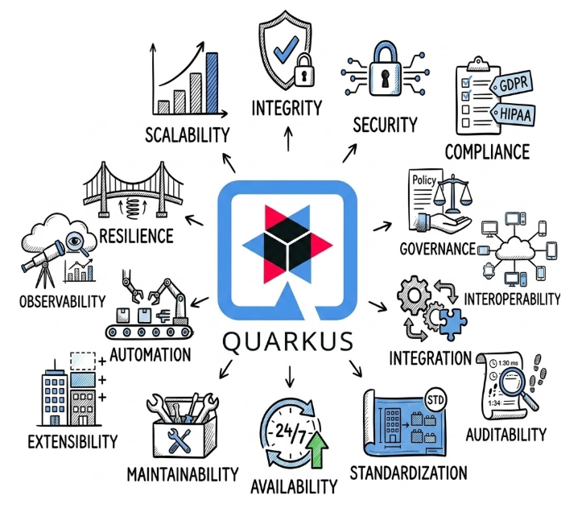

Note: Enterprise is not a buzzword. It's a checklist. Security, compliance, governance, observability, resilience, scalability, auditability, interoperability. Every one of these concerns must be addressed. That's what Quarkus does — and that's what we bring to AI.

---

## quarkus.ai

_AI is transforming enterprise software. But enterprises need more than demos._

They need a **cohesive platform**:

- _Security_ : authentication, authorization, secrets/token management, leak detection
- _Safety_ : guardrails, content filtering, adversarial input detection
- _Integration_ : with existing Java services, databases, APIs
- _Extensibility_ : pluggable models, tools, guardrails, memory
- _Observability_ : tracing, metrics, audit trails
- _Testability_ : evaluating AI behavior with sample-driven tests

<div class="key-message">Not an agglomerate of components. A unified, opinionated platform.</div>

Note: What we're about to see is not a collection of disconnected libraries. It's a cohesive strategy. Every piece fits together with the same programming model, the same CDI beans, the same configuration. That's the difference between a framework and a platform.


---

## How AI Services Work

<!-- .slide: style="text-align: center;" -->

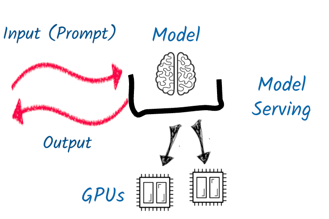

A **prompt** goes in, a **model** (hosted on model serving infrastructure) processes it, an **output** comes back. That's the foundation.

Note: Before we dive in, let's ground ourselves. An AI service is fundamentally simple : you send a prompt, a model processes it on GPUs via a model serving layer, and you get a response back. Everything we build on top — guardrails, RAG, tools, agents — is about making this loop smarter, safer, and more useful.

---

## AI-Infused Applications

<!-- .slide: style="text-align: center;" -->

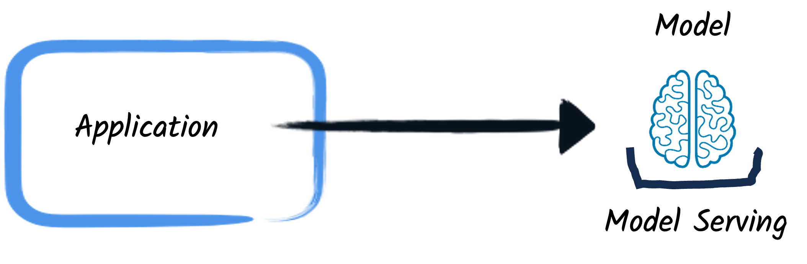

Your **application** calls a model. That's step one.

Note: The simplest AI-infused application. Your Quarkus app sends a prompt to a model and gets a response. This is what you get with @RegisterAiService and a simple @SystemMessage.

---

## Add Safety

<!-- .slide: style="text-align: center;" -->

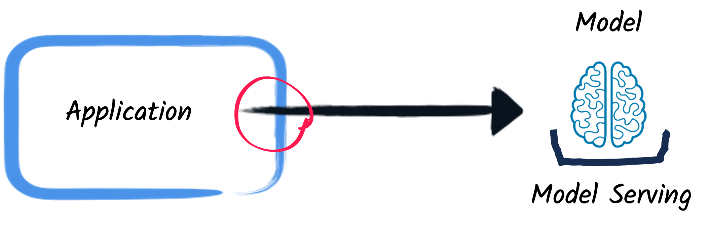

Add **guardrails** between your application and the model. Validate inputs, filter outputs.

Note: But you can't just send anything to the model and return anything to the user. You need guardrails — input validation, output filtering, topic restriction. That red circle is the control point.

---

## Add Context

<!-- .slide: style="text-align: center;" -->

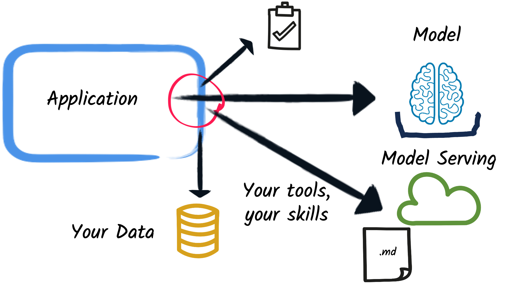

Bring in **your data**, **your tools**, **your skills**. The model now works with your enterprise context.

Note: Now we're getting real. The application doesn't just talk to a model — it injects your data via RAG, exposes your Java services as tools, loads behavioral skills from markdown files. The model works within your enterprise context.

---

## Wrap in Enterprise

<!-- .slide: style="text-align: center;" -->

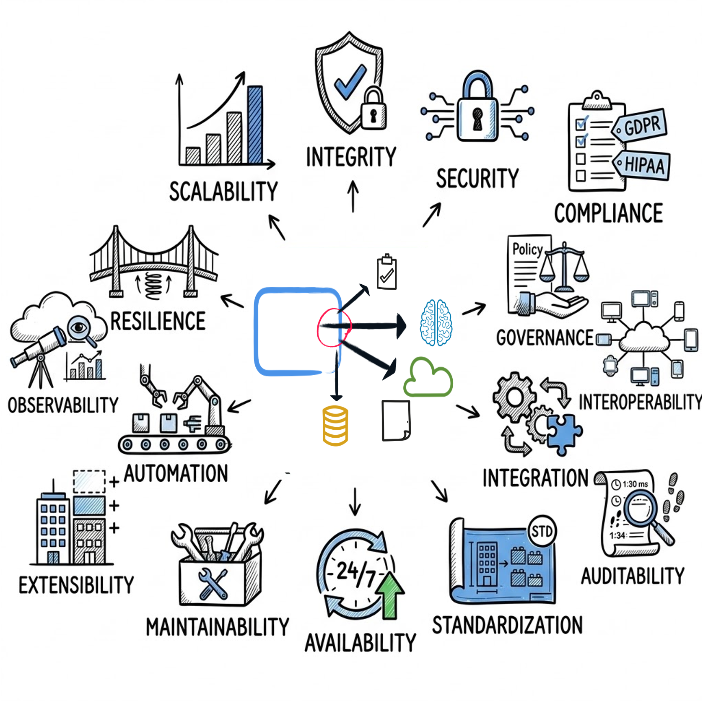

Note: And all of this must be wrapped in enterprise concerns. Security, compliance, observability, scalability, auditability — the same checklist we saw earlier. This is what Quarkus provides out of the box.

---

## Scale to Multi-Agent

<!-- .slide: style="text-align: center;" -->

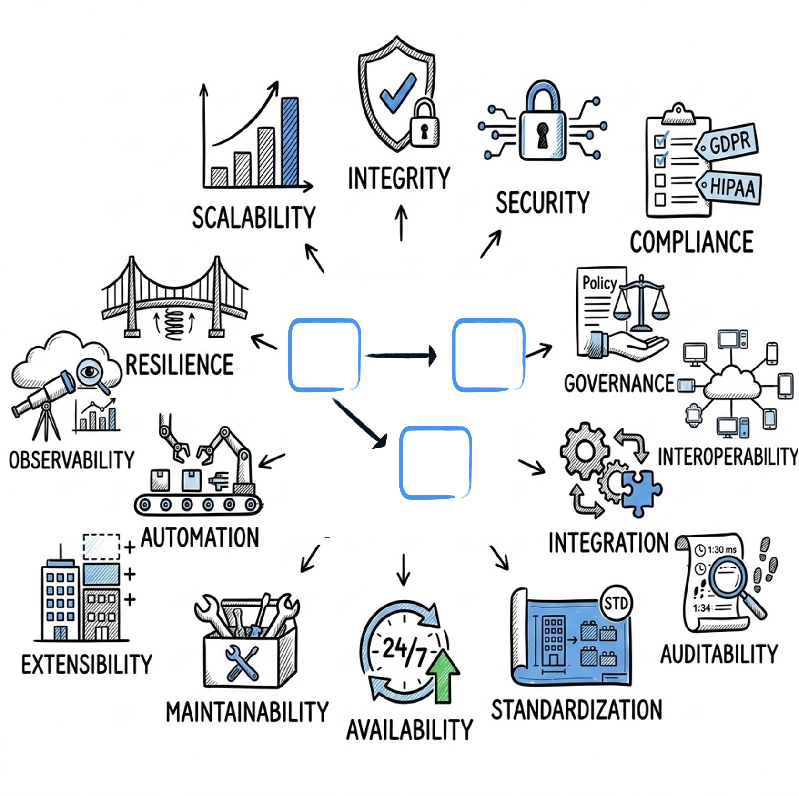

Note: Finally, you scale from one application to many. Multiple AI-infused applications coordinating via A2A, each with their own tools, data, and guardrails, all wrapped in enterprise governance. That's the full picture we'll build toward today.

---

<!-- .slide: data-background-color="#4595EB" -->

## Chapter 1: Hello, AI

Every AI journey starts with a conversation.

---

## Your First AI Service

A working AI chatbot in ~10 lines:

```java
@RegisterAiService
public interface MyAssistant {

    @SystemMessage("You are a helpful customer support agent for Acme Corp.")
    @UserMessage("Customer question: {question}")
    String chat(String question);
}
```

**10 lines of code. Any model. Hot reload your prompts.**

Note: Look at this. In Quarkus, it's a CDI interface. The @RegisterAiService annotation does the wiring.

---

## Live Demo : Hello, AI

<div class="demo-panel demo-chat">
    <div class="chat-messages"></div>
    <div class="chat-input-row">
        <input type="text" class="chat-input" placeholder="Ask Acme Corp support anything...">
        <button class="chat-send">Send</button>
    </div>
</div>

Note: Let me show you this live. Notice I can change the system prompt and the response changes immediately : no restart.

---

<!-- .slide: data-background-color="#4595EB" -->

## Chapter 2: Making It Real

From demo to production : safety, knowledge, and structure.

---

## Guardrails: Trust but Verify

LLMs hallucinate, go off-topic, leak data, can be prompt-injected.

```java
@ApplicationScoped
public class TopicGuardrail implements InputGuardrail {
    @Override
    public InputGuardrailResult validate(UserMessage message) {
        if (isOffTopic(message.singleText())) {
            return failure("I can only help with Acme products.");
        }
        return success();
    }
}
```

- **Input guardrails** : validate *before* the model
- **Output guardrails** : validate *before* the user
- Pluggable, composable, CDI beans

<div class="key-message">Your AI, your rules. Guardrails are not optional in production.</div>

Note: In production, you need control. Guardrails let you intercept every message in and every response out.

---

## RAG: Your Data, Your AI

The model doesn't know your products, your policies, your data.
<!-- .slide: style="text-align: center;" -->

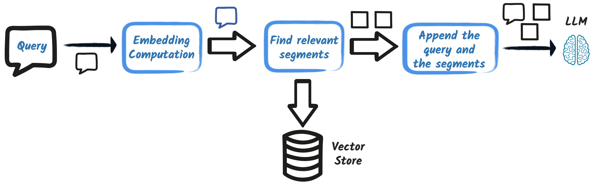

- **Document ingestion** : chunk, embed, store
- **Retrieval** : similarity search against a vector store
- **Augmentation** : inject relevant documents into the prompt

<div class="key-message">Enterprise AI gets its value from *your* data.</div>

Note: RAG bridges the gap : you embed your documents, and at query time the most relevant chunks are injected into the prompt. This is the foundation of enterprise AI.

---

## RAG goes far beyond "search and inject"


| Capability                                | Why It Matters |
|-------------------------------------------|---------------|
| **Metadata filtering and access control** | Restrict by tenant, department, date |
| **Hybrid search**                         | Combine vector + full-text for better recall |
| **Re-ranking**                            | Score and reorder results for relevance |
| **Multiple sources**                      | Databases, APIs, documents, knowledge bases |

```java
@ApplicationScoped
public class SecuredRetriever implements ContentRetriever {
    @Inject SecurityIdentity identity;
    // ...
    public List<Content> retrieve(Query query) {
        return vectorStore.search(query.text()).filter(doc -> acl.canAccess(identity, doc)).rerank(query).top(5);
    }
}
```

<div class="key-message">Enterprise RAG means secured, filtered, multi-source retrieval.</div>

Note: In the enterprise, you can't just search all documents. You need to respect access control, filter by tenant, combine multiple search strategies. This is where the CDI model shines : your retriever is a CDI bean with full access to security context, database, and business logic.

---

## Context Engineering

Context engineering is the art of composing what goes into the prompt. 
The prompt is a **composition of fragments**:

```
┌─────────────────────────────────────────────┐
│ System Message (persona, rules, tools)      │ ← cacheable
├─────────────────────────────────────────────┤
│ Context Providers:                          │
│   ├── RAG results                           │
│   ├── Conversation history                  │
│   ├── User profile                          │
│   ├── Business rules                        │
│   └── Tool & Skills                         │
├─────────────────────────────────────────────┤
│ User Message                                │ ← dynamic
└─────────────────────────────────────────────┘
```

<div class="key-message">The prompt is a view. Context providers are the model layer.</div>

Note: Think MVC for LLMs. The prompt template is the View. Context providers are the Model. Just as you use @Inject in CDI, you use context tags in the prompt. Looking at the template tells you exactly what external systems are required.

---

## The Token Budget Economy

The context window is a **finite, zero-sum economy**. 

```java
@SystemMessage("""
    You are a customer support agent.
    {#context provider="policies" maxTokens=2000 strategy="truncate"}
    {#context provider="history" maxTokens=1500 strategy="summarize"}
    {#context provider="profile" maxTokens=500 required=false}
    """)
String chat(@MemoryId String sessionId, String question);
```
<br/>

- Every fragment gets an **explicit token budget**
- **Compaction strategies** : `truncate`, `summarize`, `semantic-search`

<div class="key-message">Explicit budgets. Graceful degradation. No surprise token overflows.</div>

Note: Without explicit budget management, prompts grow unpredictably until you hit the context limit. This is a framework-level feature. Every context provider respects its token budget and uses a compaction strategy when exceeded. Enterprise AI needs this level of control.

---

## Skills: Reusable Behavioral Modules

Skills are **reusable, model-agnostic (in theory) instruction sets** loaded from the filesystem or extensions:

```yaml
 ---
name: refund-policy
description: Rules for processing refund requests
 ---
When handling refunds, follow these rules:
1. Refunds over $500 require manager approval
2. Check order age — no refunds after 90 days
3. Always verify the customer's identity first
```

- **Auto-discovered** : drop in a directory/extensions
- **Injected into context** : `SkillsSystemMessageProvider` composes them into the system message
- **Versionable** : skills evolve independently of your application code

<div class="key-message">Skills are context engineering without code. Markdown in, behavior out.</div>

Note: Skills are another context engineering mechanism. Instead of hardcoding instructions in @SystemMessage, you externalize them as markdown files. They're loaded at startup, injected into the system message via a SkillsSystemMessageProvider, and the LLM picks up the behavior automatically. This means domain experts can author and version skills without touching Java code.

---

## The Memory Service

AI agents need **persistent memory** across sessions, restarts, and devices.

The Memory Service provides:

- **Persistent conversation storage** : all messages stored with full context
- **Conversation replay and audit** : reconstruct state at any point in time
- **Conversation forking** : branch at any message to explore alternatives
- **Semantic search** : search across all conversations by meaning
- **Access control** : user-based ownership and sharing (owner, manager, reader roles)
- **Encryption at rest** : AES-256-GCM, Vault Transit, AWS KMS

```java
@RegisterAiService
public interface Agent {
    String chat(@MemoryId String conversationId, String userMessage);
}
// Memory Service provides the ChatMemoryProvider — persistent, searchable, encrypted
```

<div class="key-message">Memory that survives restarts, respects access control, and is fully auditable.</div>

Note: This is not just "chat history in a database". The Memory Service is a full persistence layer for AI agent memory. It supports conversation forking, semantic search across sessions, encryption at rest. It integrates as a Quarkus extension : your AI service just uses @MemoryId as before, but the backing storage is enterprise-grade.

---

## Live Demo : Guardrails + RAG

<div class="demo-panel demo-chat">
    <div class="chat-messages"></div>
    <div class="chat-input-row">
        <input type="text" class="chat-input" placeholder="Ask about Acme products, or try going off-topic...">
        <button class="chat-send">Send</button>
    </div>
</div>

*Try: "What's the return policy?" then "What's the weather?"*

Note: The AI knows about our products because of RAG. But when I ask something off-topic, the input guardrail catches it before it even reaches the model.

---

<!-- .slide: data-background-color="#4595EB" -->

## Chapter 3: Agents That Act

What happens when AI can use your code?

---

## Tools: Giving AI Hands

```java
@Tool("Check the status of a customer order")
public String getOrderStatus(long orderId) {
    return orderService.findById(orderId).getStatus();
}
```

- Annotate a method with `@Tool`, and the AI Service method with `@Toolbox`
- The model decides *when* and *how* to call it but it does not call it, your application does
- Runs in your Quarkus app : full CDI context, transactions, security

<div class="key-message">Your Java services are already the tools.</div>

Note: The @Tool annotation turns any Java method into something the AI can call.

---

## Guardrails for Tools

- **Parameter validation** : reject invalid inputs
- **Scope restriction** : limit access
- **Approval flows** : flag high-risk actions
- **Audit trail** : every tool call logged

<div class="key-message">Enterprise AI means controlled AI, especially for tool calls.</div>

Note: Giving AI tools is powerful : and dangerous. Can it cancel orders? Transfer funds? You need control.

---

## MCP: A Standard Protocol

```java
@MCPTool(name = "order-status", description = "Get order status")
public OrderStatus getOrderStatus(long orderId) {
    return orderService.findById(orderId).getStatus();
}
```

- **Quarkus as MCP server** : expose your services as MCP tools
- **Quarkus as MCP client** : consume external capabilities
- One protocol, universal interoperability

<div class="key-message">MCP: the USB of AI. Quarkus speaks it natively (client and server).</div>

Note: MCP is becoming a universal standard for connecting agents to tools.

---

## Securing MCP

MCP opens powerful capabilities, it also opens attack surfaces.


| Threat | Mitigation |
|--------|-----------|
| **Unauthorized access** | OAuth 2.0 / OIDC authentication on every MCP endpoint |
| **Tool poisoning** | Server fingerprinting : verify tool identity and integrity |
| **Prompt injection via tools** | Input entropy detection : flag suspiciously crafted inputs |
| **Data exfiltration** | Output guardrails on MCP tool responses |
| **Privilege escalation** | Fine-grained RBAC : which agents can call which tools |


```java
@MCPTool(name = "refund")
@RolesAllowed("support-agent")
public RefundResult processRefund(@NotNull @Max(10000) BigDecimal amount) {
    // Standard Quarkus security applies to MCP tools
}
```

<div class="key-message">MCP tools are endpoints. Secure them like endpoints.</div>

Note: MCP tools are not just methods : they are attack surfaces. You need authentication on every endpoint, fingerprinting to verify tool identity, entropy detection to catch prompt injection attempts through tool inputs. In Quarkus, MCP tools are CDI beans, so you get the full security stack : @RolesAllowed, input validation, audit logging.

---

## Live Demo : Tool-Using Agent

<div class="demo-panel demo-chat">
    <div class="chat-messages"></div>
    <div class="chat-input-row">
        <input type="text" class="chat-input" placeholder="Try: What's the status of order #1234?">
        <button class="chat-send">Send</button>
    </div>
    <div class="audit-log demo-audit-log"></div>
</div>

*Try: "What's the status of order #1234?" then "Cancel order #1234"*

Note: Watch what happens. I ask about an order : the agent calls getOrderStatus. Now I ask to cancel : the tool guardrail catches it.

---

<!-- .slide: data-background-color="#4595EB" -->

## Chapter 4: Coordinating Agents

From solo performer to orchestra.

---

## A2A: Agents Talking to Agents

- Each agent publishes an **agent card** : "here's what I can do"
- Agents discover, negotiate, and delegate
- **Federated AI** : no single monolithic agent
- **Team autonomy** : each team owns their agents

<div class="key-message">A2A: federated AI. Each team owns their agents.</div>

Note: In a real enterprise, one team owns orders, another owns inventory. You don't build one giant agent.

---

## A2A: Agents Talking to Agents

<!-- .slide: style="text-align: center;" -->

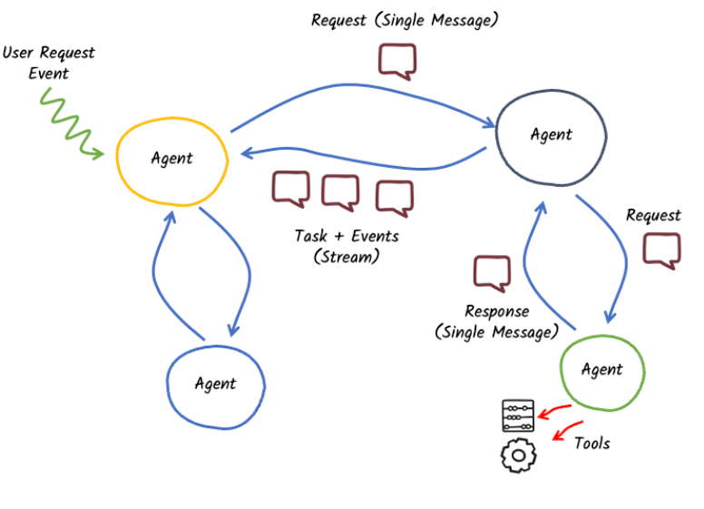

---

## The Autonomy Spectrum

<!-- .slide: style="text-align: center;" -->

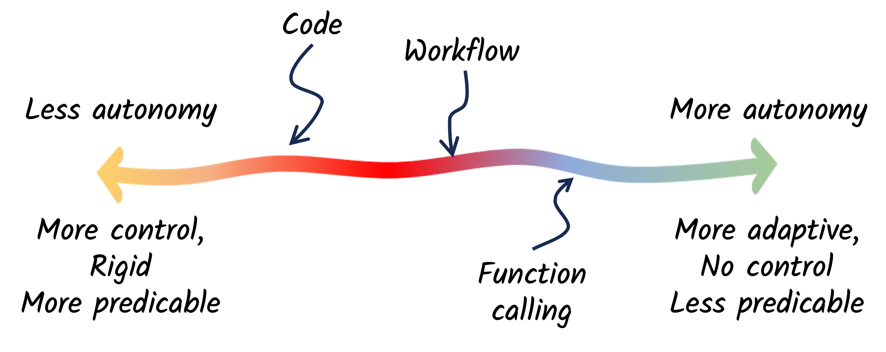

- **Code** : fully scripted, deterministic, rigid
- **Workflow** : structured orchestration with decision points
- **Function calling** : the model decides what to call and when

<div class="key-message">How much freedom do you give the AI? Quarkus lets you choose.</div>

Note: This is the most important design decision in agentic AI. On the left, you write code — full control, fully predictable. In the middle, you use workflows — structured but with flexibility at decision points. On the right, you let the model decide via function calling — adaptive but less predictable. Most enterprise applications land somewhere in the middle.

---

## The Agentic Loop

<!-- .slide: style="text-align: center;" -->

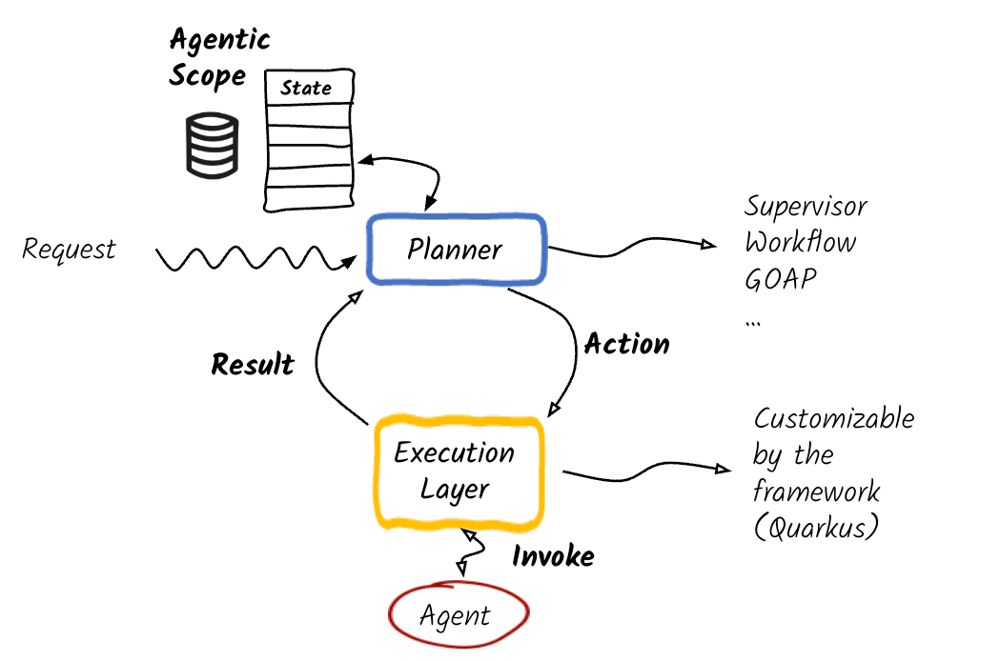

Note: Here's how it works in Quarkus. A request comes in. The Planner decides what to do — and the planner strategy is pluggable : supervisor, workflow, GOAP. It sends an action to the Execution Layer, which is customizable by the framework. The execution layer invokes an agent, gets a result, and feeds it back to the planner. The planner updates the agentic scope — persisted state — and decides the next action. This loop continues until the task is complete. Every component is a CDI bean you can replace.

---

## The Agentic Coordination Patterns

<!-- .slide: style="text-align: center;" -->


---

## Live Demo : Multi-Agent

<div class="demo-panel demo-multi-agent">
    <div class="agent-pipeline">
        <span class="pipeline-node">Planner</span>
        <span class="pipeline-arrow">→</span>
        <span class="pipeline-node">Research Agent</span>
        <span class="pipeline-arrow">→</span>
        <span class="pipeline-node">Writer Agent</span>
    </div>
    <div class="chat-input-row">
        <input type="text" class="task-input chat-input" placeholder="e.g., Research how we can improve acme.corp SEO strategy">
        <button class="task-send chat-send">▶</button>
    </div>
    <div class="agent-steps workflow-steps"></div>
    <div class="agent-result"></div>
</div>

Note: This is the @SequenceAgent in action. Two agents declared as interfaces with @Agent annotations — ResearchAgent gathers facts, WriterAgent synthesizes the report. The workflow interface ties them together with @SequenceAgent. No planner code, no manual orchestration. Just declare the sequence and Quarkus wires it up.

---

<!-- .slide: data-background-color="#4595EB" -->

## Chapter 5: Making It Durable

From impressive demos to production reality.

---

## The Problem with In-Memory Agents

Everything so far runs in memory. Enterprise workflows:

- **Take hours or days** : waiting for approvals
- **Must survive restarts** : deployments, crashes
- **Need auditability** : what happened, when, why
- **Require human-in-the-loop** : some decisions can't be automated

<div class="key-message">In-memory agents are for demos. Durable agents are for production.</div>

Note: Your agent demos work great : until the pod restarts or the approval takes three days.

---

## Quarkus Flow

A **workflow-as-code engine** built on the CNCF Serverless Workflow spec:

```java
@@ApplicationScoped
public class NewsletterWorkflow extends Flow {
    @Inject AutoDraftCriticAgent draftAgent;
    @Inject HumanEditorAgent humanEditorAgent;
    @Inject MailService mailService;
    @Override
    public Workflow descriptor() {
        return FuncWorkflowBuilder.workflow("intelligent-newsletter")
                .tasks(agent("draftAgent", draftAgent::write, NewsletterRequest.class),
                        emitJson("draftReady", "org.acme.email.review.required", NewsletterDraft.class),
                        listen("waitHumanReview", toOne("org.acme.newsletter.review.done"))
                                .outputAs((JsonNode node) -> node.isArray() ? node.get(0) : node),
                        switchWhenOrElse(h -> HumanReview.ReviewStatus.NEEDS_REVISION.equals(h.status()),
                                "humanEditorAgent", "sendNewsletter", HumanReview.class),
                        function("humanEditorAgent", humanEditorAgent::edit, HumanReview.class).then("draftReady"),
                        consume("sendNewsletter", draft -> mailService.send("subscribers@acme.finance.org", draft),
                                NewsletterDraft.class).inputFrom(input -> input.get("draft"), Map.class))
                .build();
    }

}
```

<div class="key-message">Workflows defined in Java. Compiled at build time. Durable by default.</div>

Note: Quarkus Flow is not just another workflow engine. It follows the CNCF Serverless Workflow specification, so you get a standard vocabulary. But it's implemented as a Quarkus extension, compiled at build time, with zero reflection. Workflows become CDI beans.

---

## Quarkus Flow: AI Agents as Workflow Tasks, and Workflow invocation

```java
@POST
@Path("/newsletter")
public Response newNewsletter(NewsletterRequest request) {
    final WorkflowInstance instance = newsletterWorkflow.instance(request);
    instance.start();
    return Response.accepted(Map.of("instanceId", instance.id())).build();
}
```

- **Durable execution** : agent state persisted, survives crashes
- **Human-in-the-loop** : pause, wait for approval, resume
- **Composable patterns** : `@SequenceAgent`, `@ParallelAgent`
- **Full observability** : every step traced, every decision auditable

<div class="key-message">Quarkus Flow turns AI demos into AI systems.</div>

Note: This is the key integration. AI agent calls are regular workflow tasks. They get durability, retries, tracing, human-in-the-loop for free. You can define draft-critique-revise loops with compliance checks and human approval gates. The agent scope maps bidirectionally to the workflow data context.

---

## Live Demo : Durable Workflow

<div class="demo-panel demo-workflow">
    <button class="workflow-trigger chat-send">Start Refund Workflow (Order #1238 : $499.99)</button>
    <div class="workflow-steps" style="margin-top: 1em;"></div>
    <div class="approval-buttons" style="display: none;">
        <button class="btn-approve">Approve Refund</button>
        <button class="btn-reject">Reject Refund</button>
    </div>
</div>

*The agent analyzes the request, then pauses for manager approval.*

Note: This is a real Quarkus Flow workflow. The RefundAnalysisAgent runs as an agent() task, emits a CloudEvent to Kafka, and the workflow pauses on listen(). When you click approve or reject, a CloudEvent is sent back through Kafka, the workflow resumes, and the switchWhenOrElse routes to the right branch. All durable, all event-driven.

---

<!-- .slide: data-background-color="#4595EB" -->

## Chapter 6: Trust and Verify

Observability, testing, and evaluation for production AI.

---

## Observability: Seeing Inside the AI

Every AI interaction is traced end-to-end with **OpenTelemetry**:

```text
HTTP Request
  └── AI Service: CustomerAssistant.chat
        ├── LLM Call (model, tokens in/out, latency)
        │     gen_ai.system=openai, gen_ai.operation=chat
        ├── Tool: getOrderStatus (parameters, result)
        ├── Tool: checkInventory (parameters, result)
        └── LLM Call (final response with tool results)
```

<br/>

- **Metrics** : `langchain4j.aiservices.timed` and `.counted` per AI service method
- **Traces** : full span hierarchy from HTTP request → AI service → LLM → tools
- **MCP tracing** : MCP tool calls appear as spans with parameters and results
- **Token tracking** : input/output token counts on every LLM span

<div class="key-message">Every AI decision is a span. Every tool call is a span. Full lineage.</div>

Note: This is not bolt-on observability. Every AI service method, every LLM call, every tool invocation automatically generates OpenTelemetry spans. You see the full chain: HTTP request, AI service, LLM call with token usage, tool executions, and the final response. MCP tools get the same treatment. Add quarkus-opentelemetry to your project, and it's there.

---

## AI Auditing

Beyond tracing, Quarkus fires **CDI events** you can observe for auditing:

```java
public void onToolExecuted(@Observes ToolExecutedEvent event) {
    auditLog.record(event.toolName(), event.arguments(),
        event.result(), event.invocationContext().invocationId());
}
```


| Event | When |
|-------|------|
| `AiServiceStartedEvent` | Invocation begins |
| `AiServiceCompletedEvent` | Final result computed |
| `ToolExecutedEvent` | Tool finishes execution |
| `InputGuardrailExecutedEvent` | Input guardrail evaluated |
| `OutputGuardrailExecutedEvent` | Output guardrail evaluated |

<div class="key-message">Audit every AI decision. Correlate every event. Enterprise compliance.</div>

Note: CDI events give you a programmatic hook into every stage of the AI lifecycle. You can build audit logs, compliance trails, anomaly detection. Each event carries the invocation ID so you can correlate everything that happened in a single AI call. This is how you answer "why did the AI do that?" in production.

---

## Testing AI Applications

AI is non-deterministic. Testing it requires a different approach.

```java
@Evaluate
@QuarkusTest
public class CustomerSupportTest {
    @Inject CustomerAssistant assistant;
    @EvaluationTest(
        samples = "src/test/resources/support-samples.yaml",
        strategy = SemanticSimilarityStrategy.class,
        minScore = 0.80
    )
    public String chat(Parameters params) {
        return assistant.chat(params.get(0));
    }
}
```

<div class="key-message">Declarative evaluation. Sample-driven. CI-friendly.</div>

Note: You can't assertEquals on AI output. Instead, you define evaluation samples with expected outputs, and the framework scores how close the actual output is. This runs in your CI pipeline. You set a minimum score threshold, and the build fails if the AI regresses.

---

## Evaluation Strategies

Two built-in strategies, plus custom:

| Strategy | How It Works | Best For |
|----------|-------------|----------|
| **Semantic similarity** | Cosine distance between embeddings | Factual accuracy, RAG retrieval |
| **AI judge** | An LLM evaluates the output | Tone, reasoning, complex criteria |
| **Custom** | Implement `EvaluationStrategy<T>` | Guardrail testing, format validation |


```java
EvaluationReport<String> report = Evaluation.<String>builder()
    .withSamples("src/test/resources/samples.yaml")
    .withTags("critical") // Run subset of samples tagged "critical"
    .withConcurrency(4) // Parallelize across samples
    .evaluate(params -> assistant.chat(params.get(0)))
    .using(new SemanticSimilarityStrategy(0.85))
    .run();
assertThat(report).hasScoreGreaterThan(80.0);
```

<div class="key-message">Test the retriever. Test the service. Test the API. Test the guardrails. Each layer independently.</div>

Note: You can test at four levels : the retriever alone, the AI service with the retriever, the full chat flow, and the REST API. Each level catches different regressions. The AI judge strategy is powerful for subjective criteria : "was the response polite?" or "did it follow the escalation procedure?". Tag filtering lets you run only critical tests in CI and the full suite nightly.

---

## The Full Picture

<!-- .slide: style="text-align: center;" -->

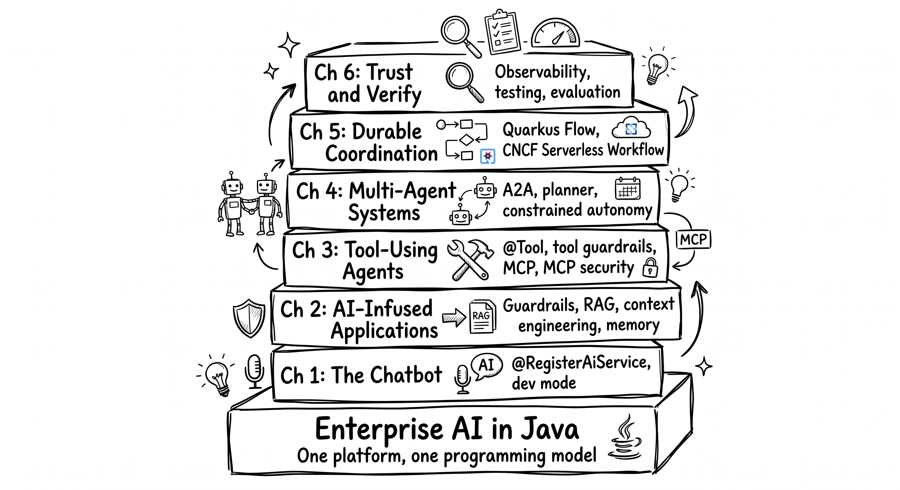


**One platform. One programming model. Every layer builds on the last.**

Note: Seven layers : from the strategy to trust and verification. Same CDI model, same configuration, same dev mode throughout. That's the difference between an agglomerate and a platform.

---

## Enterprise-Grade AI : Built In, Not Bolted On


| Concern | What You Get |
|---------|-------------|
| **Observability** | OpenTelemetry spans, metrics, CDI audit events, MCP tracing |
| **Testing** | Evaluation framework, semantic similarity, AI judge, CI-ready |
| **Security** | Auth, RBAC, MCP fingerprinting, entropy detection, secrets |
| **Fault tolerance** | Retries, fallbacks, circuit breakers |
| **Memory** | Persistent, encrypted, searchable conversation storage |
| **Durability** | CNCF workflows, human-in-the-loop, crash recovery |
| **Model portability** | Swap providers : one config property |
| **Dev experience** | Hot reload everything |

<div class="key-message">Every chapter comes with these built in. That's what a platform gives you.</div>

Note: Every chapter comes with observability, testability, security, fault tolerance, and model portability built in. That's the Quarkus AI strategy : enterprise AI in Java, cohesive, integrated, production-ready.

---

<!-- .slide: style="text-align: center;" data-background-color="#FFFFFF" -->

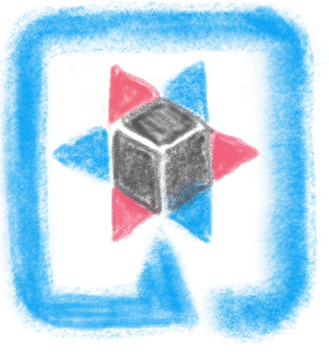<span style="font-family: var(--font-title); font-size: 2.5em; font-weight: 900; letter-spacing: 0.05em; vertical-align: middle;">QUARKUS</span>

<hr style="border: none; border-top: 2px dashed var(--color-red); margin: 0.6em 2em;">

<div style="text-align: left; display: inline-block; font-size: 0.75em; line-height: 2.2;">
🌐 &nbsp; <a href="https://quarkus.io">https://quarkus.io</a><br>
💬 &nbsp; <a href="https://quarkusio.zulipchat.com">https://quarkusio.zulipchat.com</a><br>
▶️ &nbsp; <a href="https://youtube.com/quarkusio">https://youtube.com/quarkusio</a><br>
🐦 &nbsp; <a href="https://twitter.com/quarkusio">@quarkusio</a>
</div>

<div style="display: flex; justify-content: center; gap: 2em; margin-top: 1em;">
<div style="text-align: center;">

<div style="background: var(--color-blue); color: white; padding: 0.2em 1.2em; border-radius: 4px; font-weight: 600; font-size: 0.7em; margin-top: 0.3em;">Code</div>
</div>
<div style="text-align: center;">

<div style="background: var(--color-red); color: white; padding: 0.2em 1.2em; border-radius: 4px; font-weight: 600; font-size: 0.7em; margin-top: 0.3em;">Slides</div>
</div>
</div>

